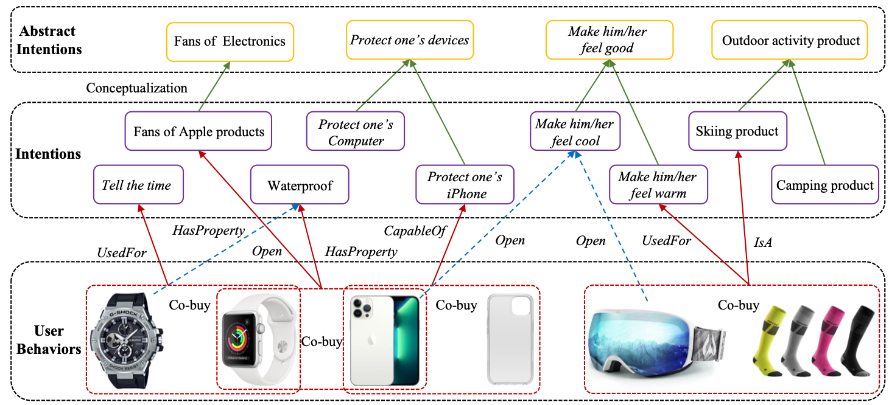

# FolkScope

Sourcecode and datasets for the paper "FolkScope: Intention Knowledge Graph Construction for Discovering E-commerce Commonsense" ([arXiv](https://arxiv.org/pdf/2211.08316.pdf))



## Datasets

We release product metadata, the annotated training datasets and the whole poplulated generations with both plausibility and typicality scores, and recommendation data in the [shared folders](https://hkustconnect-my.sharepoint.com/:f:/g/personal/cyuaq_connect_ust_hk/EhLWuDJtP5pPgPH27i5Oq1oBxfc0wDIqFxpvJhdPcdt9hA?e=6JROlg).


## Implementation

### Package Dependencies

* nltk
* wandb
* pandas
* sklearn
* evalaute
* datasets
* tqdm
* sentencepiece
* accelerate==0.9.0
* torch==1.10.1+cu111
* transformers==4.20.0
* python-igraph == 0.9.11
* stanfordnlp==0.2.0


### 1. Prompting Generation

```bash
bash scripts/run_generation.sh
```

### 2. Classifier Training and Inference
```bash
bash scripts/run_training.sh
bash scripts/run_inference.sh
```

### 3. Knowledge Graph Construction
Kind reminder: please ensure that you have more than 100GB memory for pattern mining. Otherwise, please set a smaller `num_workers`
```bash
bash scripts/run_mining.sh
bash scripts/run_match.sh
bash scripts/run_conceptualization.sh
```

## Citation

Please kindly cite the following paper if you found our method and resources helpful!

```
@article{yu2022folkscope,
  title={FolkScope: Intention Knowledge Graph Construction for Discovering E-commerce Commonsense},
  author={Yu, Changlong and Wang, Weiqi and Liu, Xin and Bai, Jiaxin and Song, Yangqiu and Li, Zheng and Gao, Yifan and Cao, Tianyu and Yin, Bing},
  journal={arXiv preprint arXiv:2211.08316},
  year={2022}
}
```

